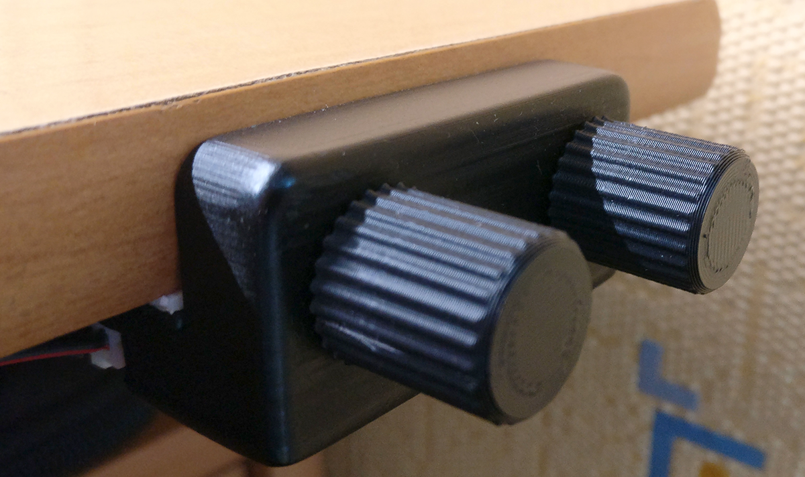
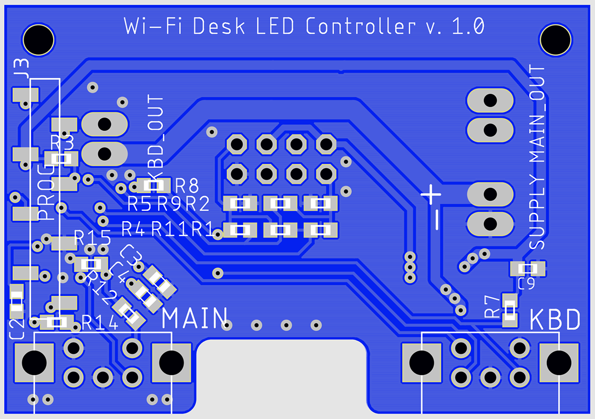
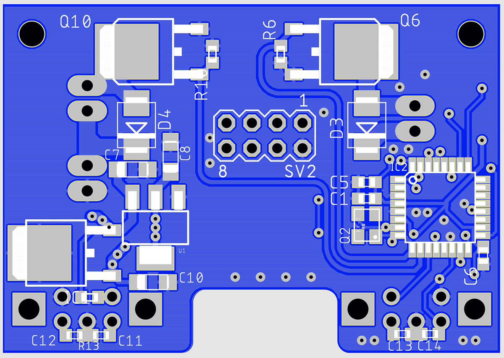
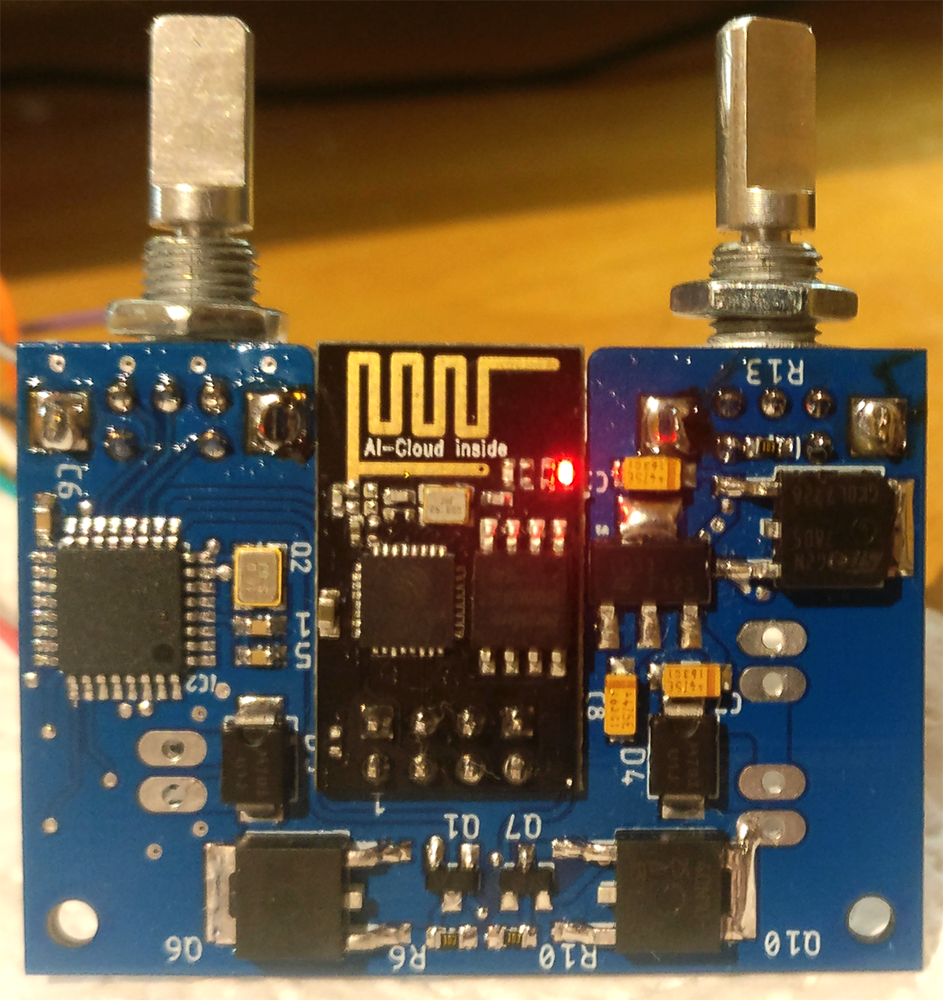
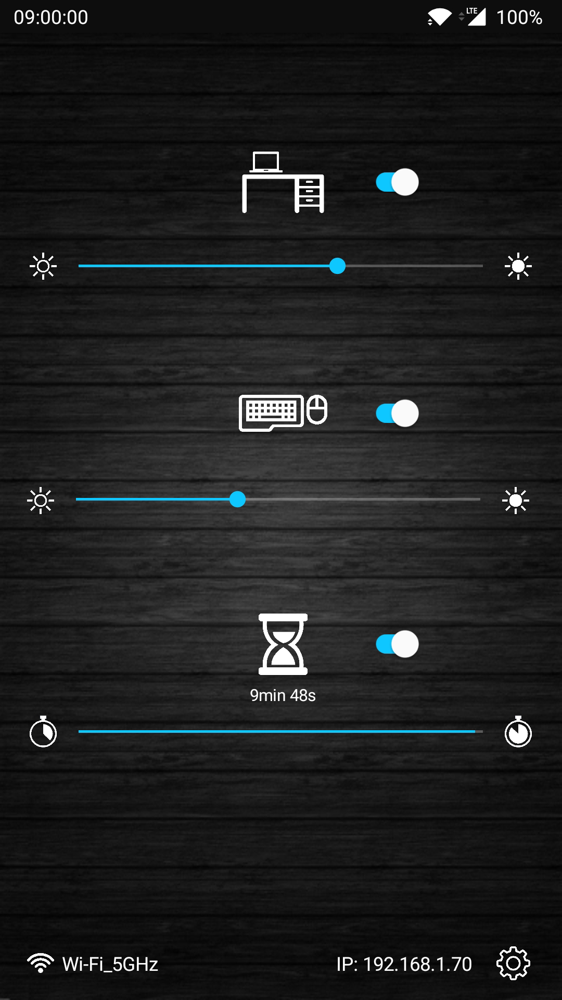

# Wi-Fi LED controller - sterownik oświetlenia LED

## Cechy:
* dwa kanały sterowania taśmami LED o mocy do 30W
* 8-bitowy PWM o częstotliwości 960Hz
* dwa enkodery inkrementalne ze zintegrowanym włącznikiem
* korekcja gamma zapewniająca liniową percepcję zmian jasności
* płynne rozjaśnianie/przyciemnianie
* łączność Wi-Fi umożliwiająca pracę w sieci lokalnej lub niezależnie przez wbudowany punkt dostępowy
* sterowanie oświetleniem z poziomu aplikacji mobilnej lub panelu kontroli w dowolnej przeglądarce internetowej
* funkcja automatycznego wyłączenia po upływie zadanego czasu (od 1min do 1,5h)

---

